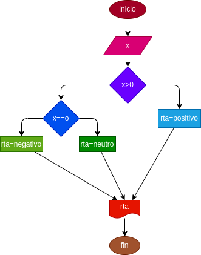

# POSITIVO_NEGATIVO
programa para saber si un numero x es positivo o negativo 

# crear un programa para verificar si un numero e par o impar 
# analisis

-variable de entrada 

x : numero ingresado 

-variable de salida 

RTA : nos va a decir si es negativo o positivo 

# Diseño 

# Construccion 

ejercicio n.5 implementar un programa q verifique di un numero es positivo o negativo 

usamos los comparadores para determinar si es positivo o negativo 
if x > 0
elif x == 0
# ESTE ARCHIVO ESTA ESCRITO EN LENGUAJE MARKDOW 
